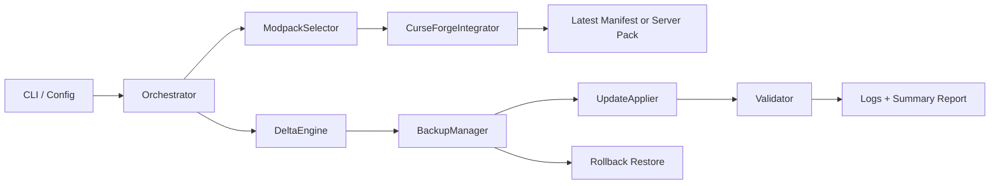

# Enhanced Prompt and Implementation Design

## 1) Goals and Assumptions

Objective: build an implementation-ready automation tool that runs on Ubuntu or in Docker and updates a user-selected Minecraft server to the latest compatible CurseForge modpack version. The tool applies deterministic deltas: unchanged mods are left in place, new or updated mods are installed, and removals are only applied when the operator enables that policy.

Success criteria:

- The server directory is updated to the latest matching modpack file for the target Minecraft version.
- Server-side packs are preferred when CurseForge exposes a server pack file.
- World data, configs, and existing untracked files are preserved.
- A full backup exists before mutation.
- Rollback can restore the pre-update state.
- Every run writes a machine-readable report and human-readable CLI output.

Constraints:

- Must run as a non-root Linux process where possible.
- Must support Ubuntu host deployment and Docker container deployment.
- Must not log CurseForge API keys.
- Must be idempotent: repeated runs do not redownload or replace unchanged managed files.

Assumptions:

- CurseForge API access is available through `CURSEFORGE_API_KEY`.
- CurseForge modpack manifests include `projectID`, `fileID`, Minecraft version, and loader metadata.
- The Minecraft server uses a standard layout with `mods/`, `config/`, `world/`, and one or more server jars.
- Some CurseForge files may not expose direct download URLs; server packs are preferred to reduce this problem.

## 2) System Architecture Overview

High-level diagram:



Data flow:

1. Operator supplies config: modpack ID, Minecraft version, server directory, API key, and update policy.
2. CurseForgeIntegrator retrieves candidate modpack files for Minecraft game ID `432` and modpack class ID `4471`.
3. ModpackSelector chooses the latest file matching the target Minecraft version.
4. If `serverPackFileId` exists and `preferServerPack` is enabled, the server pack is downloaded.
5. Otherwise, the modpack archive is downloaded and `manifest.json` is parsed.
6. DeltaEngine compares desired manifest mods against `.cf2amp-state.json`.
7. BackupManager snapshots `mods/`, `config/`, worlds, and state.
8. UpdateApplier downloads and installs only delta mods.
9. Validator checks layout, manifest compatibility, hashes where available, and optional Java startup smoke test.
10. Orchestrator writes `logs/cf2amp/<run-id>.json`.

Environment requirements:

- Python 3.11+
- Java 17+ for modern Minecraft servers, or Java version matching the selected server
- Docker 24+ for container use
- Read/write access to the server directory

## 3) Components and Interfaces

ModpackSelector:

- Input: modpack project ID, target Minecraft version, optional pinned file ID.
- Output: selected CurseForge file metadata.
- Behavior: pinned file wins; otherwise latest file for target version is selected.

CurseForgeIntegrator:

- Module: `cf2amp.curseforge`.
- Handles `x-api-key` authentication, retries, JSON parsing, and file downloads.
- Endpoints used:
  - `GET /v1/mods/search`
  - `GET /v1/mods/{modId}`
  - `GET /v1/mods/{modId}/files`
  - `GET /v1/mods/{modId}/files/{fileId}`
  - `GET /v1/mods/{modId}/files/{fileId}/download-url`

DeltaEngine:

- Module: `cf2amp.delta`.
- Input: current `ServerState`, desired `ModpackManifest`, `removeMissing` policy.
- Output: `DeltaPlan` with added, updated, removed, and unchanged mods.

BackupManager:

- Module: `cf2amp.backup`.
- Creates timestamped backups under `backups/cf2amp/<timestamp>`.
- Restores `mods/`, `config/`, worlds, and `.cf2amp-state.json`.

UpdateApplier:

- Module: `cf2amp.updater`.
- Downloads only added or updated files.
- Replaces managed files atomically from the state perspective.
- Does not delete untracked files.

Validator:

- Module: `cf2amp.validator`.
- Checks directory layout, manifest Minecraft version, loader names, Java availability, and optional startup smoke test.

Orchestrator:

- Module: `cf2amp.orchestrator`.
- Coordinates backup, update, validation, rollback, report writing, and error handling.

CLI/Config:

- Module: `cf2amp.cli`.
- Commands:
  - `cf2amp search`
  - `cf2amp update`
  - `cf2amp run --config config.yaml`
  - `cf2amp rollback --server-dir /server --backup-dir /server/backups/cf2amp/<id>`

Logging/Observability:

- JSON reports per run.
- Structured logger name: `cf2amp`.
- Optional integration point for Redis, Loki, Vector, Fluent Bit, or Prometheus wrappers.

## 4) Data Model and Configuration

Mod metadata schema:

```json
{
  "mod_id": 238222,
  "file_id": 5612345,
  "file_name": "example-mod.jar",
  "version": "1.2.3",
  "sha256": "optional-checksum",
  "dependencies": [306612],
  "server_side": true,
  "loader": "forge"
}
```

Modpack manifest structure:

```json
{
  "project_id": 925200,
  "file_id": 6543210,
  "name": "Example Pack",
  "minecraft_version": "1.21.1",
  "loader": "neoforge",
  "loader_version": "21.1.0",
  "mods": []
}
```

Server state snapshot:

```json
{
  "modpack_project_id": 925200,
  "modpack_file_id": 6543210,
  "managed_files": {
    "238222": {
      "project_id": 238222,
      "file_id": 5612345,
      "path": "mods/example-mod.jar",
      "sha256": "..."
    }
  }
}
```

Config schema:

```yaml
curseforgeApiKey: "${CURSEFORGE_API_KEY}"
modpackId: 925200
minecraftVersion: "1.21.1"
serverDir: "/server"
javaPath: "java"
javaOpts: "-Xmx4G -Xms2G"
loader: "neoforge"
updatePolicy:
  mode: "delta"
  removeMissing: false
  preferServerPack: true
  rollbackOnFailure: true
  startupValidationSeconds: 20
backupPolicy:
  enabled: true
  keepLast: 3
  includeWorld: true
  includeConfig: true
```

## 5) API and External Services

CurseForge API:

- Base URL: `https://api.curseforge.com/v1`.
- Authentication: header `x-api-key: <token>`.
- Minecraft game ID: `432`.
- Modpack class ID: `4471`.
- Rate limits: treat `429` as transient; retry with exponential backoff and jitter.
- Download URL behavior: use `downloadUrl` when present, otherwise call `/download-url`.

Optional fallbacks:

- Modrinth can be added as a secondary catalog only when a mapping from CurseForge project IDs to Modrinth project IDs is configured.
- Do not infer cross-platform identity by filename alone in production.

Local file system:

- Validate path traversal by using archive member basenames for mods.
- Validate hashes when CurseForge exposes them or after download via local SHA-256.
- Preserve ownership by running the container with the same UID/GID as the server process.

## 6) Update Workflow (Delta-Based)

Pre-checks:

- Validate config and server directory access.
- Confirm the server is stopped or ready for controlled restart.
- Verify Java is available if startup validation is enabled.

Manifest retrieval:

- Fetch latest modpack file for the requested Minecraft version.
- Prefer server pack via `serverPackFileId`.
- Otherwise parse `manifest.json`.

Delta computation:

- Compare `.cf2amp-state.json` against desired mods.
- Added: desired project exists but is not tracked.
- Updated: desired project exists with a different file ID.
- Removed: tracked project no longer exists in desired manifest and `removeMissing` is true.
- Unchanged: same project ID and file ID.

Backups:

- Create full snapshot before mutating.
- Include world, config, mods, and state.
- Prune old backups based on `backupPolicy.keepLast`.

Download and install:

- Download only added or updated mods.
- Replace previous managed file for updated mods.
- Keep untracked local mods unless explicitly managed by future policy.

Validation:

- Confirm manifest Minecraft version matches target.
- Check loader family: Forge, Fabric, NeoForge, or Quilt.
- Run optional startup smoke test for a short configured window.

Post-update:

- Write `.cf2amp-state.json`.
- Write JSON report to `logs/cf2amp/<run-id>.json`.
- Return clear CLI summary.

## 7) Error Handling, Retry and Rollback

Idempotence:

- State is keyed by CurseForge project ID for manifest mode.
- Same file ID is treated as unchanged.
- Re-running after success produces no delta.

Retries:

- Retry API failures for 429 and 5xx responses.
- Retry network failures with exponential backoff.
- Do not retry validation errors without operator action.

Rollback:

- If update or validation fails and rollback is enabled, restore the latest backup from the current run.
- Manual rollback command:

```bash
cf2amp rollback --server-dir /server --backup-dir /server/backups/cf2amp/20260620-120000
```

Error taxonomy:

- Config errors: missing key, invalid path, invalid policy.
- API errors: unauthorized, rate limited, missing modpack file.
- Download errors: blocked or missing file URL.
- Validation errors: incompatible Minecraft or failed startup smoke test.
- Filesystem errors: permission denied, insufficient space.

## 8) Security and Operational Considerations

Secrets:

- Prefer environment variable `CURSEFORGE_API_KEY`.
- Config files containing keys must be mode `0600`.
- Logs and reports must not include the API key.

Least privilege:

- Run as the Minecraft server user.
- In Docker, pass `--user "$(id -u):$(id -g)"` when writing host-mounted server files.
- Avoid privileged containers.

Auditability:

- Each run receives a UUID.
- Reports include backup ID, mode, delta counts, changed filenames, and warnings.

Observability:

- Track update duration, delta size, failures, rollback count, and validation warnings.
- Optional log shipping can be layered through Docker logging drivers or sidecars.

## 9) Deployment and Environment

Ubuntu:

```bash
sudo apt update
sudo apt install -y python3 python3-venv openjdk-21-jre-headless
python3 -m venv .venv
. .venv/bin/activate
pip install .
export CURSEFORGE_API_KEY="your-key"
cf2amp run --config config/example.config.yaml
```

Docker:

```bash
docker build -t cf2amp .
docker run --rm \
  --user "$(id -u):$(id -g)" \
  -e CURSEFORGE_API_KEY="$CURSEFORGE_API_KEY" \
  -v "$PWD/config/example.config.yaml:/config/config.yaml:ro" \
  -v "/opt/minecraft/server:/server" \
  cf2amp run --config /config/config.yaml
```

Compose:

```bash
docker compose up --build cf2amp
```

## 10) Testing and Validation Plan

Unit tests:

- DeltaEngine added, updated, removed, unchanged behavior.
- Config parser for JSON and minimal YAML.
- CurseForgeIntegrator with mocked JSON responses.
- BackupManager backup and restore.

Integration tests:

- Mock CurseForge API server returning example modpack files and download URLs.
- Disposable server directory with fake mods and state.
- Verify only delta files are modified.

End-to-end:

- Run `cf2amp run --config samples/mock.config.yaml` against a dummy server.
- Assert report JSON and state file match expected output.

## 11) Example Workspace Layout

```text
cf2amp-serverupdater/
  cf2amp/
    backup.py
    cli.py
    config.py
    curseforge.py
    delta.py
    models.py
    orchestrator.py
    state.py
    updater.py
    validator.py
  config/
    example.config.yaml
    example.config.json
  docs/
    DESIGN.md
  docker-compose.yml
  Dockerfile
  scripts/
    update.sh
  samples/
    server/
  tests/
```

## 12) Minimal Runnable Prototype

Python delta skeleton:

```python
import dataclasses

from cf2amp.delta import DeltaEngine
from cf2amp.models import ModMetadata, ModpackManifest
from cf2amp.state import ManagedFile, ServerState

state = ServerState(
    modpack_project_id=1,
    modpack_file_id=10,
    managed_files={
        "100": ManagedFile(project_id=100, file_id=1, path="mods/a.jar"),
    },
)
manifest = ModpackManifest(
    project_id=1,
    file_id=11,
    name="Example",
    minecraft_version="1.21.1",
    loader="forge",
    loader_version="52.0.0",
    mods=[
        ModMetadata(mod_id=100, file_id=2, file_name="a-2.jar"),
        ModMetadata(mod_id=200, file_id=1, file_name="b-1.jar"),
    ],
)
plan = DeltaEngine().calculate(state, manifest, remove_missing=False)
print(dataclasses.asdict(plan))
```

Bash lifecycle:

```bash
CONFIG_PATH=/config/config.yaml SERVER_DIR=/server scripts/update.sh
```

Dockerfile:

```dockerfile
FROM python:3.12-slim
WORKDIR /app
COPY pyproject.toml README.md /app/
COPY cf2amp /app/cf2amp
RUN pip install --no-cache-dir .
ENTRYPOINT ["cf2amp"]
```

## 13) Example Input/Output

Input:

```yaml
modpackId: 925200
minecraftVersion: "1.21.1"
serverDir: "/server"
updatePolicy:
  mode: "delta"
  removeMissing: false
  preferServerPack: true
```

Existing state:

```json
{
  "managed_files": {
    "100": {"project_id": 100, "file_id": 1, "path": "mods/a-1.jar"},
    "300": {"project_id": 300, "file_id": 1, "path": "mods/c-1.jar"}
  }
}
```

Desired manifest:

```json
[
  {"mod_id": 100, "file_id": 2, "file_name": "a-2.jar"},
  {"mod_id": 200, "file_id": 1, "file_name": "b-1.jar"}
]
```

Expected delta with `removeMissing: false`:

```json
{
  "added": ["b-1.jar"],
  "updated": [{"from": "mods/a-1.jar", "to": "a-2.jar"}],
  "removed": [],
  "unchanged": []
}
```

Expected output:

- `/server/mods/a-2.jar` installed.
- `/server/mods/b-1.jar` installed.
- `/server/mods/c-1.jar` preserved because removals are disabled.
- `/server/backups/cf2amp/<timestamp>` created.
- `/server/logs/cf2amp/<run-id>.json` written.

## 14) Clarifying Questions

- Should missing mods from the new modpack manifest be removed automatically, or only reported by default?
- How is the Minecraft server stopped and started in your environment: systemd, AMP, Docker, tmux, or a custom script?
- Should config file overrides from modpack server packs be applied, merged, or only reported?
- Which loaders must be first-class for your servers: Forge, Fabric, NeoForge, Quilt, or mixed?

## Best Model Recommendation

Use GPT-5 Codex for implementation work because it can reason across architecture, code generation, Docker artifacts, tests, and iterative debugging. For a cheaper planning-only pass, use GPT-5 mini; for production code changes and review, use GPT-5 Codex.
